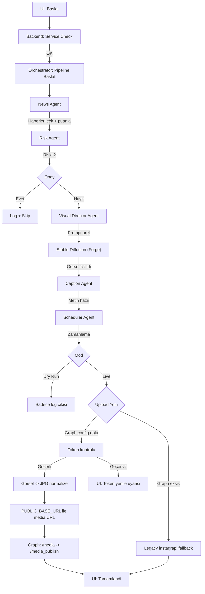

# Atlas Assistant (Web + Otonom Ajan)

[](https://github.com/AsirCan/ATLAS-AI-SD-LLAMA/actions/workflows/tests.yml)

Bu repo, web arayüzlü bir sesli asistan/üretim stüdyosu ve Instagram için **otonom (multi-agent) içerik üretim ajanı** içerir.

## Özellikler

### Web arayüz (React/Vite)
- **Chat**: `/api/chat` üzerinden Ollama ile sohbet.
- **Görsel çizim**: `/api/image` üzerinden Stable Diffusion (Forge API) ile görsel üretimi.
- **STT/TTS**: `/api/stt` ve `/api/tts` ile konuşma → yazı ve yazı → ses.
- **Instagram Studio**:
  - Günlük tek içerik üretimi (haber → prompt → görsel → caption).
  - 10’lu carousel üretimi.
  - “Otonom ajan”ı UI’den başlatma, adım adım ilerleme ekranı ve canlı log görüntüleme.

### Otonom ajan (Multi-Agent Pipeline)
- **Orchestrator tabanlı pipeline**: haber seçimi → risk filtresi → görsel üretimi → caption → zamanlama → (dry-run veya upload).
- **UI’de anlaşılır durum**:
  - `stage` + yüzde ilerleme + adım listesi + canlı loglar.
  - Ajan çalışırken UI, GPU/VRAM’i yormamak için diğer işlemleri ve navigasyonu kilitler.
- **İptal**:
  - UI’den “İptal Et” ile **güvenli durdurma** (cooperative cancel).
  - Not: Eğer o an Stable Diffusion çiziyorsa, iptal isteği **o adım bitince** uygulanır.

## Kurulum

## Sıfırdan hızlı başlangıç (Windows)

Bu bölüm “hiç bilmeyen” biri için en baştan kullanım adımlarını özetler.

1. Repoyu indir/klonla ve klasöre gir.

2. Python sanal ortamını oluştur ve aktif et:

```powershell
python -m venv .venv
.venv\Scripts\activate
```

3. Kurulum sihirbazını çalıştır (Python paketleri + Forge + model + Ollama model pull):

```powershell
python install.py
```

4. `.env.example` → `.env` yap.
   - `python install.py` artık Cloudflared helper'ı da kurar.
   - Graph API değerlerini istersen elle `.env` içine yaz, istersen UI'den kaydet (Studio > Instagram Bağlantı Ayarları > Graph API > "UI'dan .env Kaydet").

5. Uygulamayı başlat:

```powershell
python run.py
```

6. Tarayıcıda açılan arayüzde:
   - **Chat**: yaz/konuş → cevap al.
   - **Studio**: “Günlük Tek İçerik”, “10’lu Carousel” veya “Otonom Ajan”.
   - **Graph ilk kurulum**: Studio > Instagram Bağlantı Ayarları > Graph API sekmesinde `FB_APP_ID`, `FB_APP_SECRET`, `FB_PAGE_ID`, `IG_USER_ID`, `FB_ACCESS_TOKEN` değerlerini girip kaydet.
   - **Video**: gündem videosu üret.

Notlar:
- Ajan çalışırken UI diğer işlemleri ve navigasyonu kilitler (GPU/VRAM için).
- “İptal Et” butonu **güvenli durdurma** yapar; SD çizim anında ise adım bitince durur.
- Graph API alanları doluysa `python run.py` tunnel helper'ı otomatik başlatır ve `PUBLIC_BASE_URL` günceller (`AUTO_TUNNEL=1`).

### Gereksinimler
- **Python**: 3.10+
- **Node.js**: (frontend için)
- **Ollama**: `https://ollama.com/`
- **Stable Diffusion**: Forge veya WebUI API (varsayılan: `127.0.0.1:7860`)
- (Video modunu kullanacaksan) **FFmpeg** sistemde kurulu olmalı.

### TTS (Piper) notu (Windows)
- TTS için `models/` altında şu iki dosya gerekir:
  - `tr_TR-fahrettin-medium.onnx`
  - `tr_TR-fahrettin-medium.onnx.json`
- Windows’ta bazı `pip install piper-tts` kurulumlarında `espeakbridge` eksik olduğu için `/api/tts` hata verebilir.
  - Çözüm: **standalone Piper** (piper.exe) kullan.
  - `.env` içine `PIPER_BIN=C:\...\piper.exe` yaz **veya** `tools/piper/piper.exe` olarak projeye koy (otomatik bulunur).

### Instagram Graph API kurulumu (yeni kullanıcı için)
Bu proje Instagram yüklemede öncelikle **Graph API** kullanır (daha stabil). Adımlar:

1. Meta for Developers'ta bir app oluştur (`Business` tipi).
2. App'e Instagram use case / Instagram API ekle.
3. Business Settings'te:
   - Instagram hesabını business'a ekle,
   - Facebook sayfası ekle,
   - Instagram hesabını ilgili Facebook sayfasına bağla.
4. Graph API Explorer'da şu izinlerle User Token üret:
   - `pages_show_list`
   - `pages_read_engagement`
   - `instagram_basic`
   - `instagram_content_publish`
5. Doğrulama istekleri:
   - `/me/accounts?fields=id,name,access_token`
   - `/{FB_PAGE_ID}?fields=instagram_business_account`
   - `/{IG_USER_ID}?fields=id,username`
6. Değerleri `.env` içine yaz:
   - `FB_PAGE_ID` (`/me/accounts` çıktısından)
   - `IG_USER_ID` (`instagram_business_account.id`)
   - `FB_ACCESS_TOKEN` (Explorer token)
7. `PUBLIC_BASE_URL` ayarla:
   - Uygulama dış dünyadan erişilebilir bir URL'de olmalı (ör. reverse proxy/tunnel/domain).
   - Graph API, `generated_images` altındaki dosyaları bu URL üzerinden okur (`/images/...`).

Not:
- `PUBLIC_BASE_URL` yoksa Graph API ile upload çalışmaz.
- Graph API alanları boşsa sistem **durur ve eksikleri bildirir**; eski yönteme (`instagrapi`)
  otomatik geçmez (bkz. Güvenlik modeli).

### Hangi giriş yöntemini kullanmalıyım?
- **Öncelik (ve tek desteklenen yol):** Graph API (`FB_*`, `IG_USER_ID`, `PUBLIC_BASE_URL` doluysa)
- **Legacy (`instagrapi`): varsayılan olarak KAPALI.**
  `instagrapi` Instagram'ın resmi olmayan mobil API'sini taklit eder; kullanım şartlarına
  aykırıdır ve hesabın kısıtlanmasına/kapatılmasına yol açabilir.
  Graph API eksikse sistem **sessizce bu yola düşmez** — hangi alanların eksik olduğunu söyleyip durur.
  Riski bilerek kabul ediyorsan `.env` içine `ALLOW_LEGACY_INSTAGRAPI=1` ekle.

### Yeni kuran biri için 1 dakikalık kontrol listesi
`.env` içinde şu alanlar **boş olmamalı**:

```env
FB_APP_ID=
FB_APP_SECRET=
FB_PAGE_ID=
IG_USER_ID=
FB_ACCESS_TOKEN=
PUBLIC_BASE_URL=
IMGBB_API_KEY= # opsiyonel ama onerilir
IG_GRAPH_VERSION=v24.0
```

`ATLAS_API_TOKEN` alanini elle doldurmana gerek yok — `python run.py` uretir.

Hızlı doğrulama (Explorer):
- `/me/accounts?fields=id,name`
- `/{FB_PAGE_ID}?fields=instagram_business_account`
- `/{IG_USER_ID}?fields=id,username`

### Yükleme
1. Bağımlılıkları kur:

```powershell
python install.py
```

2. `.env.example` dosyasını `.env` yap ve Graph API alanlarını doldur:
   - `FB_APP_ID`, `FB_APP_SECRET`, `FB_PAGE_ID`, `IG_USER_ID`, `FB_ACCESS_TOKEN`, `PUBLIC_BASE_URL` (opsiyonel: `IMGBB_API_KEY`)

## Çalıştırma

### Web UI (önerilen)
Backend + Frontend’i birlikte başlatır ve tarayıcıyı açar:

```powershell
python run.py
```

### CLI: Otonom ajan
UI olmadan, doğrudan pipeline çalıştırır:

**Dry Run (Instagram’a yüklemez)**

```powershell
python run.py --agent
```

**Live Mode (Instagram’a yükler)**

```powershell
python run.py --agent --live
```

## Testler

```bash
pip install -r requirements-dev.txt
pytest
```

Testler **ağa, GPU'ya, Ollama'ya, Stable Diffusion'a veya Instagram'a hiç dokunmaz.**
Ağır bağımlılıklar (`instagrapi`, `feedparser`, `speech_recognition`, `keyring`)
`tests/conftest.py` içinde stub'lanır; veritabanı yolları geçici klasöre yönlendirilir.
Bu yüzden `requirements-dev.txt`, `requirements.txt`'in tamamını gerektirmez.

Kapsam raporu için:

```bash
pytest --cov=core --cov=web/backend --cov-report=term-missing
```

Neyin test edildiği:

| Alan | Dosya |
|---|---|
| Risk filtresi (blacklist/eşik/whitelist) | `tests/test_risk_agent.py` |
| Haber toplama ve skorlama formülü | `tests/test_news_agent.py` |
| SD prompt normalizasyonu | `tests/test_visual_agent.py` |
| Pipeline guard'ları ve iptal akışı | `tests/test_orchestrator.py` |
| LLM JSON üretimi, retry, iptal | `tests/test_llm_service.py` |
| TTL tabanlı haber hafızası | `tests/test_news_memory.py` |
| API token koruması, CORS, sır sızıntısı | `tests/test_backend_api.py` |
| Görsel sunucusu izolasyonu | `tests/test_image_server.py` |
| Legacy instagrapi kapısı | `tests/test_insta_legacy.py` |
| Caption hashtag biçimlendirme | `tests/test_caption_format.py` |
| API token üretimi/doğrulaması | `tests/test_api_auth.py` |

CI (`.github/workflows/tests.yml`) her PR'da Python 3.10/3.11/3.12 üzerinde
testleri ve ayrıca frontend build'ini çalıştırır.

## API (kısa özet)
- **Chat**: `POST /api/chat`
- **Image**: `POST /api/image`
- **STT**: `POST /api/stt`
- **TTS**: `POST /api/tts`
- **Ajan başlat**: `POST /api/agent/run?live=false|true`
- **Ajan durum**: `GET /api/agent/progress` (status/percent/stage/current_task/logs/…)
- **Ajan iptal**: `POST /api/agent/cancel` (cooperative cancel)

## Mimari (dosya düzeyi)
- **Backend (FastAPI)**: `web/backend/main.py`
- **Frontend (React/Vite)**: `web/frontend/`
- **Agent Orchestrator**: `core/pipeline/orchestrator.py`
- **Agent’lar**: `core/agents/`
  - `NewsAgent` → haberleri toplar ve skorlar
  - `RiskAgent` → güvenlik filtresi
  - `VisualDirectorAgent` → görsel prompt + SD çizim
  - `CaptionAgent` → caption üretimi
  - `SchedulerAgent` → paylaşım zamanı
- **LLM katmanı (tek yol)**: `core/clients/llm.py` (`LLMService` + legacy wrapper’lar)
- **Stable Diffusion istemcisi**: `core/clients/sd_client.py`
- **Instagram istemcisi**: `core/clients/insta_client.py`
- **İçerik katmanı (haber/caption/üretim)**: `core/content/`
- **Runtime katmanı (config + sistem kontrolleri)**: `core/runtime/`

### Core moduler klasor yapisi

```text
core/
  agents/      # Pipeline agent implementations
  clients/     # External service clients (LLM, SD, Instagram)
  content/     # News + caption + visual content helpers
  pipeline/    # Orchestrator + shared pipeline state
  runtime/     # Config + startup/system checks
```

## Otonom ajan algoritması (adım adım)



### 0) UI/Backend koordinasyonu
- UI, `POST /api/agent/run` ile background job başlatır.
- UI, `GET /api/agent/progress` ile her saniye durum çeker:
  - `status`: `idle | running | done | error | cancelled`
  - `stage`: `services_check | init | news | risk | visual | caption | schedule | publish | done | error | cancelled`
  - `percent`: 0–100
  - `logs`: canlı log satırları
- UI, ajan çalışırken diğer işlemleri ve sidebar navigasyonunu kilitler (VRAM/GPU yükünü azaltmak için).
- UI’den `POST /api/agent/cancel` ile iptal isteği gönderilebilir (cooperative).

### 1) Servis kontrolü (backend)
1. Ollama portu kontrol edilir; çalışmıyorsa başlatılır.
2. Stable Diffusion (Forge API) portu kontrol edilir; çalışmıyorsa başlatılır ve hazır olana kadar beklenir.
3. Bu bekleme sırasında cancel flag set edilirse job güvenli şekilde durur.

### 2) Orchestrator pipeline (core)
Orchestrator aşağıdaki sırayla ilerler (her adım loglanır ve UI’ye yansır):
1. **News Gathering**: RSS kaynaklarından haberleri alır ve skorlar.
2. **Risk Analysis**: marka güvenliği/risk filtresi uygular.
3. **Visual Generation**: seçilen haberden görsel prompt üretir ve SD ile görsel çizer.
4. **Captioning**: caption üretir.
5. **Scheduling**: paylaşım zamanı belirler.
6. **Publishing**:
   - Dry-run ise upload atlanır.
   - Live ise Instagram upload yapılır.

### 3) Tamamlama
- Başarılı: `status=done`, `percent=100`
- İptal: `status=cancelled` (cooperative)
- Hata: `status=error` + `error` alanı


## Güvenlik modeli

Ana backend (`web/backend/main.py`, port 8000) **her zaman yalnızca `127.0.0.1`'e bağlanır ve
asla tünellenmez.** Instagram Graph API'nin görseli indirebilmesi için gereken public erişim,
ayrı ve salt-okunur bir servisle sağlanır:

| Servis | Port | Dışarı açık | İçerik |
|---|---|---|---|
| `web/backend/main.py` | 8000 | ❌ Hayır | Tüm `/api/*` uçları, LLM, SD, ajan |
| `web/backend/image_server.py` | 8010 | ✅ Evet (tünel) | Yalnızca `generated_images/`, sadece GET |

Ek katmanlar:

- **API token:** `/api/*` uçları `X-Atlas-Token` başlığı ister. Token `.env` içinde
  `ATLAS_API_TOKEN` olarak tutulur; `python run.py` ilk çalıştırmada üretir ve frontend'e
  `web/frontend/.env.local` üzerinden otomatik aktarır — elle bir şey kopyalaman gerekmez.
- **CORS:** `*` yerine whitelist. Varsayılan `http://127.0.0.1:5173` ve `http://localhost:5173`;
  `ALLOWED_ORIGINS` ile değiştirilebilir.
- **Sır sızıntısı yok:** `GET /api/imgbb/config` anahtarı geri döndürmez; yalnızca kurulu olup
  olmadığını ve son 4 haneyi verir. UI'daki alan yalnız-yazılırdır.
- **Legacy upload kapalı:** bkz. "Hangi giriş yöntemini kullanmalıyım?".

> Not: Tünel açıkken `generated_images/` altındaki tüm görseller URL'i bilen herkese açıktır.
> Bu, Graph API akışının doğası gereğidir — Instagram görseli internetten kendisi indirir.

### 401 alıyorsan
Backend ile frontend farklı token kullanıyordur. Uygulamayı kapatıp `python run.py` ile
yeniden başlat; token her açılışta senkronlanır.

## Instagram Upload Algoritmasi

Bu repo artik varsayilan olarak **Graph API + auto tunnel** akisina gore calisir.

1. `python run.py` calisir ve `ATLAS_API_TOKEN` hazirlanir.
2. Graph alanlari doluysa (`FB_*`, `IG_USER_ID`) once salt-okunur gorsel sunucusu (port 8010),
   ardindan tunnel baslar (`tools/setup_tunnel.py`). Tunnel **yalnizca 8010'a** baglanir.
3. Tunnel URL `.env` icine `PUBLIC_BASE_URL` olarak yazilir.
4. Studio > Instagram Baglanti Merkezi uzerinden alanlar kaydedilir, token durumu kontrol edilir.
5. Upload sirasinda backend:
   - token gecerliligini kontrol eder,
   - gorseli Graph icin JPG'e normalize eder,
   - local dosya yolunu public URL'e cevirir (`PUBLIC_BASE_URL/images/...`),
   - `/{IG_USER_ID}/media` ve `/{IG_USER_ID}/media_publish` adimlarini cagirir.
6. Tunnel URL fetch sorunu olursa fallback olarak gecici public host denemesi yapilir (IMGBB_API_KEY varsa once ImgBB kullanilir).
7. Graph alanlari eksikse islem **durur** ve eksik alanlar bildirilir.
   Legacy `instagrapi` yoluna otomatik dusulmez (`ALLOW_LEGACY_INSTAGRAPI=1` gerekir).

## Yeni Endpointler (Guncel)

- `POST /api/instagram/graph-config`
- `GET /api/instagram/graph-config`
- `GET /api/instagram/token-status`
